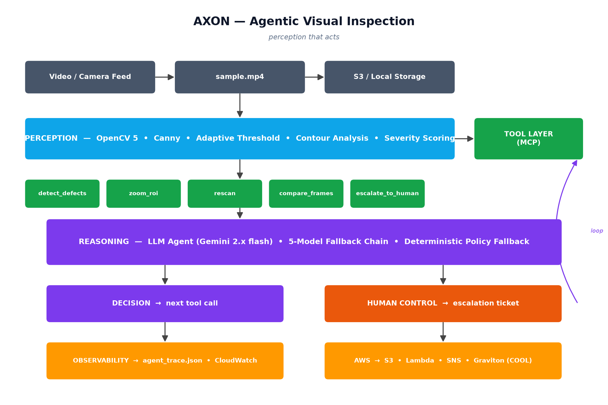

# AXON

**Perception that acts.**

An agentic visual inspection system. OpenCV 5 perceives defects. A
language-model agent decides what to do about them. Every decision is
traceable.

---

## The problem

Detection is solved. Decision-making isn't.

Computer vision can find a crack, a corrosion patch, or a missing
component with superhuman accuracy. Yet on most factory floors and
pipelines, a human still walks the line and decides what to do about
each defect.

AXON closes that loop.

---

## What it does

AXON runs an agentic loop:

1. OpenCV 5 finds defects in video and returns structured output
2. A language-model agent reads that output and picks the next tool
3. The tool executes, changing what the system does next
4. Every step is logged with reasoning, model used, and result

The visual evidence literally changes what the system does next. It's
not a detector with a chat interface.

---

## Architecture

**Perception (OpenCV 5)**
- Frame ingestion and preprocessing (bilateral filter, CLAHE)
- Canny edges + adaptive threshold + morphological cleanup
- Contour analysis with area, solidity, and edge-density scoring
- Severity classification: low / medium / high

**Tools (MCP-style)**
Five callable tools the agent uses to change state:
- `detect_defects` — run the pipeline over a video
- `zoom_roi` — crop and upscale a suspect region
- `rescan` — re-run detection at adjustable sensitivity
- `compare_frames` — check whether a defect persisted
- `escalate_to_human` — log an escalation with a ticket ID

**Reasoning (LLM agent)**
- Google Gemini with a prioritized 5-model fallback chain
- Structured JSON output contract
- Deterministic policy fallback if the LLM is unavailable
- Every decision logged to `out/agent_trace.json`

---

check here ="https://devpost.com/software/axon-3dhew6"
